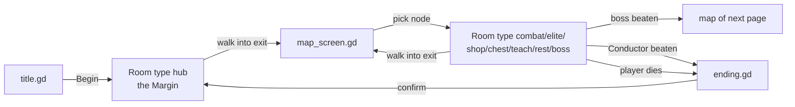
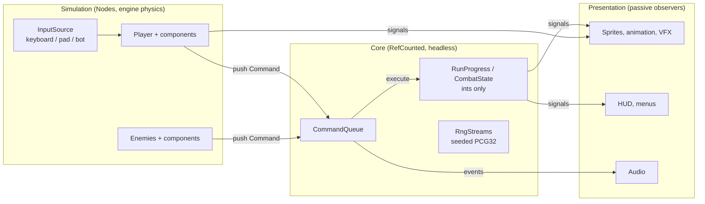

# The Discordant: Architecture

This document has three parts. Part 1 audits the v1.0 prototype. Part 2 sets the architecture the rebuild follows, with reference code for the first slice (the player controller). Part 3 maps each prototype system to its rebuild target.

# Part 1: Audit of the prototype

> **File paths changed after this audit.** The code was split into files under 300 lines on 2026-09-25 without behavior changes. `docs/FILE_MAP.md` maps every path and line count below to its new location.

> **Untyped back-references cut from 313 to 34, on 2026-09-28, without behavior changes** (Task 6, four steps, each merged separately): typed content ids for characters, powers, runes, relics, enemies and pages; `EnemyRoster` (a room's enemy list — alive enemies, the boss, pending spawns); `RewardFlow` (enemy deaths, clears, boss defeats, death, leaving, and the rewards that follow); and `Arena` + `RoomFx` + `FightState` (geometry; fx/text/shake/announce; frozen/active/enemy-speed/hush/decoy). Player and Enemy hold each of these typed, instead of reaching through `var room: Node`. The remaining 34 calls, and why each stays, are recorded in the "Untyped back-references" row below and in the project's known-gaps notes.

This audit covers the v1.0 prototype (release v1.0, 2026-09-24): Godot 4.7.2, GDScript, GL Compatibility renderer. It documents what the code does today, so it can be rebuilt properly. The prototype is a disposable reference implementation and is not refactored in place.

**Summary for the rebuild**

- There is **one `.tscn` file** (`src/main.tscn`). Every other node is created in code with `.new()`, so the editor shows almost nothing. There are **0 `@export` and 0 `@onready`** in the project.
- There are **no art or audio assets**. All visuals are `_draw()` calls (`Glyph`, per-class `_draw`), and all sound is synthesized at boot (`Synth`).
- All game data lives in **one file of constant dictionaries** (`src/data/content.gd`), looked up by string ids.
- Three classes carry most of the logic. `Room` (729 lines) is a god object that everything else reaches into. `Player` (923 lines) holds movement, attacks, the damage pipeline and every rune hook. `Enemy` (962 lines) holds all 24 `ai` behaviors (17 regular enemies, the practice dummy and 6 elites) in `match ai:` blocks.
- There is **no formal state machine** anywhere. State is timers, booleans and strings.
- Hit detection is **distance and `Rect2` checks** against `room.alive_enemies()`, not `Area2D`.

---

## 1. Project directory and scene map

```
the-discordant/
  project.godot            main scene, 3 autoloads, display and renderer settings
  export_presets.cfg       Windows + Linux export (pck embedded)
  src/
    main.tscn  main.gd     the only scene: a Node that swaps screens
    autoload/  beat.gd  synth.gd  game.gd
    data/      content.gd  pal.gd  glyph.gd  loot.gd
    world/     room.gd  layout.gd  map_gen.gd  events.gd  interactable.gd  background.gd
    actors/    player.gd  powers.gd  enemy.gd  bosses/{boss,timpani,flute,harp,conductor,grand_staff}.gd
    fx/        fx.gd (inner classes)  projectile.gd
    ui/        ui.gd  overlay.gd  hud.gd  choice.gd  dialogue.gd  menu_list.gd
               loadout.gd  pause_menu.gd  map_screen.gd  title.gd  ending.gd
  tools/       smoke.gd  playthrough.gd  capture.gd   (headless test bots, screenshots)
  docs/        DESIGN.md
```

### Scenes and scripts by system

Every "scene" below is a script instantiated with `.new()`. The only scene file is `main.tscn`.

| System | Script | Base type | class_name | Created by | Lines |
| --- | --- | --- | --- | --- | --- |
| Entry | `main.gd` (on `main.tscn`) | Node | none | project main scene | 51 |
| Managers | `autoload/beat.gd` | Node | autoload `Beat` | project.godot | 111 |
| Managers | `autoload/synth.gd` | Node | autoload `Synth` | project.godot | 626 |
| Managers | `autoload/game.gd` | Node | autoload `Game` | project.godot | 404 |
| Level | `world/room.gd` | Node2D | `Room` | `main._swap("hub"/"room")` | 729 |
| Level | `world/layout.gd` | static | `Layout` | called by `Room._ready` | ~160 |
| Level | `world/map_gen.gd` | static | `MapGen` | `Game.new_page` | ~100 |
| Level | `world/background.gd` | Node2D | none | `Room._ready` (preload) | ~145 |
| Level | `world/interactable.gd` | Node2D | `Interactable` | `Layout._add` | 181 |
| Level | `world/events.gd` | static | `Events` | `Room._interaction` | 215 |
| Player | `actors/player.gd` | CharacterBody2D | `Player` | `Room._ready`, `Room.respawn_player` | 923 |
| Player | `actors/powers.gd` | static | `Powers` | called from `Player` | 299 |
| Enemies | `actors/enemy.gd` | CharacterBody2D | `Enemy` | `Room.spawn_enemy_now` | 962 |
| Enemies | `actors/bosses/boss.gd` | Enemy | `Boss` | base for bosses | ~120 |
| Enemies | `bosses/timpani, flute, harp, conductor, grand_staff.gd` | Boss | none | `Room._spawn_boss` via `load(path)` | 90 to 150 each |
| FX | `fx/fx.gd` | inner classes `FX.Base`, `Slash`, `FloatText`, `Ring`, `Shockwave`, `Splat`, `Pickup`, `Pillar` (StaticBody2D), `Tornado`, `Decoy`, `Trail`, `Column`, `SpawnMark` | `FX` | `Room.add_fx` | 429 |
| FX | `fx/projectile.gd` | Node2D | `Projectile` | `Room.add_projectile` | ~150 |
| Data | `data/content.gd` | static consts | `Content` | read everywhere | 403 |
| Data | `data/pal.gd` | static | `Pal` | colors and SystemFont helpers | ~60 |
| Data | `data/glyph.gd` | static | `Glyph` | all procedural drawing | 266 |
| Data | `data/loot.gd` | static | `Loot` | reward rolls | ~110 |
| UI | `ui/hud.gd` | CanvasLayer (layer 5) | none | `Room._ready` | 242 |
| UI | `ui/overlay.gd` | Control | `Overlay` | base for modal screens | ~55 |
| UI | `ui/choice.gd`, `dialogue.gd`, `menu_list.gd`, `loadout.gd`, `pause_menu.gd` | Overlay | none | `Room.offer/dialogue/menu/open_overlay`, map screen, title | 100 to 170 each |
| UI | `ui/map_screen.gd`, `title.gd`, `ending.gd` | Control | none | `main._swap` | 130 to 185 each |
| UI | `ui/ui.gd` | static | `UI` | text and panel drawing helpers | ~85 |

### Runtime node tree (built in code)

```
Main (Node, main.gd)
  <current screen>                one of: title.gd | map_screen.gd | ending.gd | Room
  CanvasLayer (layer 50)          fade ColorRect, always moved to last child

Room (Node2D)
  StaticBody2D (layer 1)          floor, walls, ceiling
  StaticBody2D x N (layer 2)      one per staff-line segment, one-way collision
  Background (Node2D, z -10)
  Node2D  actors                  Player (+ Camera2D child), Enemy, Boss
  Node2D  projectiles             Projectile
  Node2D  fx                      FX.* and FX.Pillar (StaticBody2D, layer 1)
  Interactable x N                added directly under Room by Layout
  HUD (CanvasLayer 5)
    Control canvas                draws the HUD
    <overlay>                     at most one Overlay at a time
  Timer x N                       one-shot delays from Room._after
```

---

## 2. Execution flow and autoloads

**Entry:** `project.godot` sets `run/main_scene="res://src/main.tscn"`. `main.gd._ready` stores itself in `Game.main`, builds the fade layer, and calls `show_screen("title")`.



Screen swaps go through `Game.goto(screen, args)`, then `main.show_screen`, then a **deferred** `main._swap`. `_swap` unpauses the tree, resets `Beat.tempo_scale`, frees the old screen, instantiates the new one, and fades from paper color over 0.35 s. For `"hub"` it first calls `Game.preview_run(last_char)`.

**Autoload order:** `Beat`, then `Synth`, then `Game`. `Beat._latency()` reads `Game.settings`, and `Synth._ready` calls `Game.settings` through `apply_volumes`. Both work only because they are called after all three autoloads exist.

### Beat (`autoload/beat.gd`)

| | |
| --- | --- |
| Role | The global clock. Music, enemy actions, boss patterns and hit judgement all hang off it. |
| State | `bpm`, `running`, `tempo_scale`, `_t` (song seconds), `_step` (sixteenth index) |
| Signals | `step(n)` every sixteenth, `beat(n)` every 4 steps, `bar(n)` every 4 beats |
| Process mode | `ALWAYS`. It keeps ticking under pause menus, so every listener must check `get_tree().paused` itself. |
| API | `start(bpm)`, `stop()`, `beat_len()`, `step_len()`, `beat_index()`, `phase()`, `distance_to_beat()`, `distance_to_offbeat()`, `signed_offset()`, `is_on_beat(window)`, `time_to_next_beat()` |

### Synth (`autoload/synth.gd`)

| | |
| --- | --- |
| Role | Generates every sound at boot (8 instruments, 6 drums, 15 effects, about 160 ms), plays them from a pool of 28 `AudioStreamPlayer`s, and runs a generative song per page. |
| State | `instruments`, `sfx`, `song`, `_phrase` (4 bars of 16 steps), `_bass_line`, `playing`, `kazoo`, `hush` (setter drives a low-pass filter) |
| Buses | Creates `Music` and `SFX` buses at runtime. The Music bus gets an `AudioEffectLowPassFilter`. |
| Listens to | `Beat.step` (sequencer) |
| API | `play()`, `note(inst, midi)`, `sfx_play()`, `start_song(def)`, `stop_song()`, `apply_volumes()` |

### Game (`autoload/game.gd`)

| | |
| --- | --- |
| Role | Run state, meta save, settings, input map, derived stats, screen routing. |
| State | `settings` (dict), `meta` (dict, saved), `run` (dict, not saved), `main` (Node), `_stats_cache`, `_stats_dirty` |
| Signals | `run_changed`, `toast(text, color)` |
| Save | JSON at `user://discordant_save.json`, or `user://discordant_test_save.json` when launched with `--script`/`-s`. |
| Input | `_setup_input` registers 13 actions at runtime with `InputMap.add_action` (none in project.godot). |
| API | `new_run`, `preview_run`, `new_page`, `advance_page`, `enter_node`, `finish_node`, `grant`, `learn_power`, `stats()`, `flag(name)`, `family_counts()`, `dissonances()`, `goto`, `end_run` |

`Game.run` shape (a plain Dictionary):

```
char, hp, sharps, powers[{id,lvl}], runes_owned[], rune_slots[], permanent[], relics[],
clefs[], page_i, map{page,nodes[],layers[]}, node, coda_used, kills, rooms, started,
seed, preview?, grand?
```

---

## 3. Character and enemy mechanics

### Player physics (`actors/player.gd`, `_physics_process`)

| Constant | Value | Notes |
| --- | --- | --- |
| `GRAV` | 2100 px/s² | Multiplied by 0.12 during Updraft |
| `JUMP_V` | 790 px/s | Air jumps use `JUMP_V * 0.92` = 726.8 |
| `MAX_FALL` | 980 px/s | 90 during Updraft |
| `COYOTE` | 0.10 s | |
| `BUFFER` | 0.13 s | Used for both jump and attack buffering |
| `DASH_SPEED` / `DASH_TIME` / `DASH_CD` | 720 px/s / 0.15 s / 0.75 s | Cooldown × `(1 - dash_cdr)`, capped at 0.8 reduction |
| Ground / air accel | 3200 / 2200 px/s² | `velocity.x = move_toward(vx, dir * speed(), accel * dt)`. There is no separate friction; decel uses the same accel. |
| Speed | `base_speed * (1 + stats.speed)`, then × 1.3 during Accelerando | Base speed per character: 270 / 215 / 250 / 330 |
| Variable jump | Releasing Jump while `vy < -200` sets `vy *= 0.5` | |
| Dive / pound | `vy = 1400`, `vx = 0` until landing | Shockwave in the air, Mundo's air attack |
| Drop-through | Down + Jump on a one-way body turns off mask bit 2 for 0.22 s | |
| Collision | Layer 4, mask 1 and 2. `RectangleShape2D` of `size*2.4 × size*2.0`. `size` is 13 (15 for Mundo), × 0.72 with Diminution, × 1.3 with Augmentation. | |
| Wall jump | **None** | |

**Jump height:** `h = JUMP_V² / (2·GRAV)` = 790² / 4200 ≈ **148.6 px** for the first jump and ≈ 125.8 px for air jumps. The staff lines are 110 px apart (`floor_y` 660, lines at 550 / 440 / 330 / 220 / 110), so a single jump clears one line.

**Frame order:** timers, input read, floor check (resets `jumps_left = jumps - 1` **every frame on the floor**), horizontal, vertical, jump or drop, jump cut, dash override, `velocity += push; push = 0`, attack, drumroll tick, `move_and_slide()`, 4'33" check, history record for Da Capo.

### Player "states" (implicit, no FSM)

There is no state machine. Behavior is gated by timers and flags on the Player:

| Implicit state | Driven by | Blocks |
| --- | --- | --- |
| Dashing | `dash_t > 0` | sets velocity; i-frames via `is_hittable()` |
| Attacking | `atk_cd`, `swing_t`, `combo`, `combo_t` | next attack until `atk_cd <= 0` |
| Diving / pounding | `diving` ("", "shock", "pound") | horizontal input; forces vy 1400 |
| Drumroll | `drumroll_n > 0` | attack input, facing changes |
| Charging (Breath Charge) | `charging >= 0`, `charge` 0 to 1 | attack; speed × 0.35 |
| Parry | `parry_t > 0` | converts hits into parries |
| Caesura | `caesura_t > 0` | attacks; untargetable and unhittable |
| Staggered | `stagger_t > 0` | all input |
| Invulnerable | `iframes > 0` | damage (0.8 s after a hit) |
| Fade / 4'33" | `fade_t`, `still_t` | enemy targeting (`is_targetable()`) |
| Dead | `dead` | everything |

### Attacks by character (`Player._attack`)

| Character | Hits | Cadence (s, ÷ `1 + atk_speed`) | Hitbox | Knockback |
| --- | --- | --- | --- | --- |
| Quarter | 10, 10, 17 | 0.26, 0.26, 0.34 | rect 80×56 at (+40, -6) | (160, -90); third hit (380, -220) |
| Half | 16, 22, plus a 45% repeat half a beat later | 0.40 | rect 92×66 at (+46, -6) | (260, -120) |
| Mundo | 24 | 0.56 | circle r 78 at (+26, 0) | 420 radial, -160 up |
| Mundo (air) | pound ring r 115 (× `1 + big_waves`), 30 dmg, 0.4 s stun | 0.50 | on landing | 500 radial |
| Eighth | 7, 7, 7, 12 | 0.16 | rect 68×46 at (+38, -4); sets `vx = facing * 520` (lunge) | (140, -60) |

The hitbox is sampled **once, on the frame of the button press**. It does not follow the character (issue #10).

### Damage out (`Player.deal`), exact formula

```
mult = base_dmg * (1 + dmg)
     * (1 + power_dmg)            if kind == "power"
     * (1 + proj_dmg)             if kind == "proj"
     * (1 + max(0, speed-250)/5 * 0.01)   if horn_scaling
     * (1.5 + beat_bonus)         if on_beat
         * (1 + crescendo_flag * streak)  (streak ≤ 10)
     * (1 + accent)               first hit on this enemy
     * (1 + stunned_bonus)        target stunned or airborne
     * 2                          first hit out of Fade
     * rand(0.2, 3.0)             Out of Tune
     * (1 + min(dim, (e.r - size)/size * 0.4))   Diminution vs bigger target
amount = base * mult
```

After damage lands, `deal()` runs lifesteal, on-beat heal, beat cooldown refund, Kazoo instakill, Tether share (60%), Echo repeat, Half Note Sustain, Double Stop, Cymbal crash, Pizzicato wave and Mallet shockwave. Secondary hits pass `proc: false` so they don't chain.

**Power damage:** `POWERS[id].dmg * (1 + 0.3*(lvl-1)) * pillar_scale`. Cooldown: `cd * (1 - 0.12*(lvl-1)) * (1 - clamp(cdr, 0, 0.6))`.

| Pillar | `pillar_scale` |
| --- | --- |
| Percussion | `1 + max(0, max_hp - 100) / 200` |
| Wind | `clamp(speed / 270, 0.8, 2.2)` |
| String | `1 + 0.06 * (runes_owned + permanent count)` |
| Rest | 1 |

### Damage in (`Player.take_hit`)

```
if not hittable (unless opts.unblockable): return
if parry_t > 0: parry instead (stun enemies within 120 for 1.2 s, primed, cd × 0.4)
shield absorbs first
amount *= (1 - clamp(dr, 0, 0.75)) * (1 + dmg_taken)
if glass: amount = max(amount, max_hp * glass)
iframes = 0.8 * (1 + iframe_bonus); knockback (340, -360) unless Mundo
if hp <= 0: Coda (once) or die
```

### Beat judgement

`on_beat = Beat.is_on_beat(stats.beat_window)`. The base window is 0.085 s, × 1.3 for Quarter Note, floored at 0.03 s. `distance_to_beat` subtracts `AudioServer.get_output_latency()` (falls back to 0.03 s if outside 0 to 0.2) plus the user's `beat_offset_ms`. With Syncopation it uses `distance_to_offbeat`. Parry-primed and the Tempo Marking relic force it true. Judgement is pass/fail, with no falloff (issue #12).

### Enemy physics and behavior (`actors/enemy.gd`)

| | |
| --- | --- |
| Gravity | `GRAV = 2000`, fall capped at 1100. Player uses 2100 (inconsistent). |
| Collision | Layer 8. Mask 1+2 for walkers, 1 for flyers (they pass through staff lines). `CircleShape2D r * 0.9`. |
| Time scale | `d = delta * room.enemy_speed_scale * (1.35 if buff_t > 0)`. Velocity is scaled around `move_and_slide`. |
| Knockback | `velocity = knock * (1 + knockback flag) * (1 - weight)`, `knock_t = 0.22*(1-weight) + 0.04`. AI is skipped while `knock_t > 0` or `stun > 0`. |
| Contact damage | distance < `r + player.size`, cooldown 0.8 s, × 1.3 when buffed, × 1.5 while dashing |
| Scaling by page | `hp × (1 + 0.45 * page_i)`, `dmg × (1 + 0.22 * page_i)` (`Room.spawn_enemy_now`) |
| Targeting | `target_pos()`: the decoy, else the player if targetable, else a wander point `home.x + sin(t*0.6 + offset) * 220` |

**Enemy "FSM":** one string, `state`, with a timer `st` and a `telegraph` timer. Values used: `""`, `windup`, `air`, `charge`, `swoop`, `tether`, `bind`, `dash`, `hang`, `shake`, `fall`, `rest`, `rise`, `gust_windup`, `dive`, `pull`, `pull_windup`. Transitions happen in two places:

- `ai_process(d)` runs every frame. It does movement and time-based transitions (for example `charge` goes to `""` when `st` runs out or on a wall hit).
- `ai_beat(n)` runs on every `Beat.beat`. It does the attacks. The general rule is wind up (`_tele()`, which shows the red `>`) on one beat and strike on the next, keyed on `(n + beat_offset) % k`.

| `ai` | Enemies | Per-frame | On beat |
| --- | --- | --- | --- |
| walker | Quarter Rest (the same movement code also runs guard, binder, warden, tether, Timpanist and Cellist) | chase if `|dy| < 90`, else patrol and turn at walls or edges (raycast) | wind up within 150 px, then lunge (380, -260) |
| jumper | Snare Rest | brake on floor | every other beat, hop toward the player; landing sends small shockwaves |
| dropper | Whole Rest | hang, shake 0.4 s, fall, rest 1.4 s, rise | none |
| charger | Half Rest, Cymbalist, Hornist | charge at `spd` for `st` | wind up, then charge 0.75 s |
| flyer | Eighth Rest | hover offset from the player, swoop | wind up on beat 3, swoop next beat |
| shooter | Sixteenth Rest, Violist | hover 280 px to the side | fire on even beats |
| gust | Gust Rest | hover | push the player (1100) plus 3 gust shots |
| echo | Echo Rest | hover | bouncing shot (3 bounces) every 3 beats |
| guard | Rimshot Guard | walker | stance returns after 4 beats |
| buffer | Bandleader | keep 320 px away | buff allies within 440 for 4 beats |
| well | Breath Reed | stationary | buff and heal all enemies by 1 HP per beat |
| dasher | Staccato Rest | hover | wind up on beat 2, dash 0.5 s at 900 px/s |
| phantom | Breathless Rest | hover | invisible on beats 4 to 7 of 8 |
| motif | Motif Rest | hover | marking wave every 2 beats |
| binder | Unison Rest | walker | bind for 4 beats; hits on it redirect to the player |
| warden | Reverb Warden | walker | barrier on for 2 beats of 4 |
| elite_* | 6 elites | mixes of the above | bar-phrased patterns (`n % 4`, `n % 8`) |

**Bosses** (`Boss` extends `Enemy`) override `ai_process`, `ai_beat`, `draw_body` and `on_land`. Phases trigger at HP fractions in `phase_at` (default `[0.66, 0.33]`; the Conductor uses `[0.75, 0.5, 0.2]`). Stuns on bosses are × 0.2.

---

## 4. Signals and event wiring

### Scene file connections

`main.tscn` has **no `[connection]` entries**. Every connection is made in code.

### Signal connections in code

| Emitter | Signal (params) | Listener | Where connected | Notes |
| --- | --- | --- | --- | --- |
| `Beat` | `step(n: int)` | `Synth._on_step` | `synth.gd:43` | the music sequencer |
| `Beat` | `beat(n: int)` | `Enemy._on_beat` then `ai_beat(n)` | `enemy.gd:82` | one connection per enemy; never disconnected (freed with the node) |
| `Beat` | `beat(n: int)` | `Player._on_beat` (Theremin, Hurdy-Gurdy) | `player.gd:105` | |
| `Beat` | `beat(n: int)` | HUD lambda (`_beat_pulse = 1.0`) | `hud.gd:23` | |
| `Beat` | `bar(n: int)` | `Player._on_bar` (String set 3 auto-wave) | `player.gd:104` | |
| `Game` | `toast(text: String, color: Color)` | `HUD._on_toast` | `hud.gd:24` | |
| `Game` | `run_changed()` | **nothing** | | emitted in 5 places, never listened to |
| HUD `canvas` | `draw()` | `HUD._draw_hud` | `hud.gd:21` | |
| `Timer` | `timeout()` | lambda calling a stored Callable | `room.gd:679`, `player.gd:630` | `Room._after`, `Player._later` |
| overlay | `tree_exited()` | lambda that unpauses the tree | `room.gd:695` | `Room.open_overlay` |

**Who emits `Game.toast`:** `Game.grant`, `Game.learn_power`, `Game._on_keeper_defeated`, `Room.spawn_enemy_now` (first-encounter tips), `map_screen._ready`.

### Hidden wiring: Callables instead of signals

These act like signals but are passed as `Callable` fields, so they don't show up as connections anywhere:

| Caller | Callable field | Invoked by |
| --- | --- | --- |
| `Room.offer(title, sub, ids, cb, ...)` | `choice.callback(id)` | `choice._choose` |
| `Room.dialogue(speaker, lines, cb)` | `dialogue.callback()` | `dialogue._done` |
| `Room.menu(title, options, cb)` | `menu_list.callback(index)` | `menu_list._pick` |
| `Events.*` | nested lambdas into offer/menu | chains such as bench, then rehearse, then level up |

### Direct cross-object calls (no signals)

Everything talks through `room` (an untyped `var room: Node` on every actor and FX). There are **313 `room.` references across 19 files**: Enemy 52, Layout 50, Player 44, Events 40, Background 32, Powers 30, FX 20, HUD 15, bosses 51. The Room API everyone calls:

`player`, `width`, `floor_y`, `line_ys`, `frozen`, `enemy_speed_scale`, `decoy`, `add_fx`, `add_projectile`, `alive_enemies`, `enemies_in_circle`, `nearest_enemy`, `ground_below`, `float_text`, `shake`, `hurt_flash`, `announce`, `beat_feedback`, `add_line_fx`, `on_player_strike`, `on_dummy_hit`, `on_enemy_died`, `on_player_died`, `on_power_used` (empty), `start_fermata`, `spawn_enemy_now`, `combat_active`, `base_hush`, `offer`, `dialogue`, `menu`, `open_overlay`, `respawn_player`, and the private `_telegraph_spawn` (called from `Boss.summon`).

---

## 5. Math, algorithms and configs

### Level geometry (`Room`, `Layout`)

| Value | Number |
| --- | --- |
| Viewport | 1280 × 720, stretch `canvas_items`, aspect `keep_height` |
| Floor | y = 660 |
| Staff lines | y = 550, 440, 330, 220, 110 (`line_ys`), 110 px apart |
| Room width | combat `1900 + rand(0, 700)` (+200 on Wind); elite 1600; boss, shop, chest, teach and rest 1280; hub 2800 |
| Segments | each line walks x from `220 + rand(0, 200)`; segment length `rand(200, 560)`; gap `rand(120, 280) + 20 * line_index`; placed with probability `density[line]` |
| Density per line (bottom to top) | Percussion .8 .65 .45 .25 .1; Wind .55 .7 .75 .7 .55; String .7 .6 .6 .5 .3; default .7 .6 .5 .4 .2 |
| Features | Drum: bounce `vy = -1180`, resets jumps. Updraft: 90 px wide, `vy = max(vy - 3400·dt, -560)`. Harmonic node: 140 px ring for 18 damage, 1.2 s cooldown. |
| Exit | open when `player.x > width - 80` and below the top line |

No reachability check and no overlap check on features (issues #4, #7).

### Waves (`Room._build_waves`)

- `n_waves = 2`, +1 with 50% chance from page 1 onward.
- `count = 3 + page_i + rand(0..1)`, +1 on the last wave, capped at 8.
- Elite rooms have 2 waves: `[minion]`, then `[elite, minion]`.
- Spawn points: 30 tries to land more than 300 px from the player. Flyers spawn at y 150 to 420. Walkers spawn on segments (45%) or the floor.
- Spawn telegraph: 0.75 s (`FX.SpawnMark`).

### Map (`MapGen.generate`)

Pillar pages have layers `[combat] + [2, 3, 3, 2 branching] + [rest] (35%: [rest, chest]) + [boss]`. Elite, shop, chest and teach are each placed once on distinct layers. There's a 60% chance of a second elite on layer 4. Each node links to its nearest 1 or 2 nodes in the next layer (second link if `|dx| < 0.42`), and orphaned nodes get linked. One combat node on each pillar page is secretly marked `secret` (the Scribble). The Podium page is `[rest, shop] + [boss]`; the Grand page is `[boss]`.

### Economy and loot

- Sharps per kill: `round(def.sharps * (1 + stats.sharps)) + kill_sharps`.
- Heal drop: 8% per kill (value 10), 100% from elites (value 25).
- Combat clear: 25% chance of a "Bonus drop" pick (2 runes + 1 relic).
- Shop: 2 relics, 1 rune, then a margin rune 35% of the time (else a relic), and a heal for 35♯.
- Rune prices: margin 120, permanent 140, family 75, other 65. Relic prices come from `RELICS[id].price`.
- Rare runes enter the pool 33% of the time.

### Stats (`Game.stats`)

Base values come from the character. Sources are relics + permanent runes + slotted runes + family set tiers + dissonances. `mods` add to stat keys and `flags` add to a flags dict. The result is cached until `mark_dirty()`.

Stat keys: `max_hp`, `speed`, `dmg`, `atk_speed`, `cdr`, `dr`, `beat_window`, `jumps`, `dash_cdr`, `lifesteal`, `sharps`, `power_dmg`, `proj_dmg`, `pierce`, `dmg_taken`, `enemy_proj_slow`, `beat_bonus`, `base_speed`, `base_dmg`.

There are 38 flag names read through `Game.flag()`, all string literals checked with `Game.flag("name")` (for example `crescendo`, `cymbal_crash`, `piper_dash`, `glass`, `kazoo`, `thunderclap`).

### Audio (`Synth`)

- Sample rate 22050 Hz, mono 16-bit, generated in GDScript.
- Pitch uses `pitch_scale = 2^(semitones / 12)` from a single sample per instrument.
- Hush low-pass: `cutoff = lerp(18000, 520, hush^0.6)`. The lead is muted while `hush >= 0.5`.
- Song: a seeded 4-bar phrase in an A B A' C shape. Strong-beat chord tones are picked from `chord + [0, 2, 4, 7]`, and steps in between move by `[-1, 1, 1, -2, 2]`. BPM per page: 92 / 108 / 124 / 96 / 116 / 132.

### Bosses (selected constants)

| Boss | HP | Pattern constants |
| --- | --- | --- |
| Hollow Timpani | 1000 | leap `vx = clamp(dx/air, ±760)`, `vy = -GRAV·air·0.5`, `air = beat_len·0.95`; shockwaves `520 + 60·phase` px/s for 1.8 s; summons 2 Snare Rests every 16 beats from phase 2 |
| Breathless Flute | 950 | gust push `4200·dt` for 2 beats; 10-shot ring every 4 beats from phase 2; dive at 900 px/s in phase 3 |
| Unstrung Harp | 1100 | pull `3800·dt`; 12-string sweep one per 2 steps, with gap at index 7 |
| Conductor | 2100 | phases at 0.75 / 0.5 / 0.2; Finale sets `Beat.tempo_scale = 1.25`; teleports every 8 beats |
| The Score | 3000 | one line strike per beat, never on the eye's line; note rain from phase 2; homing clefs in phase 3 |

---

## 6. Technical debt and fragile logic

### Hardcoded paths and string lookups

- **No `$Node/Path` or `get_node("...")` in `src/`.** Nodes are held as script variables instead. The `tools/` scripts use `root.get_node("Game")` and `root.get_node("Beat")`.
- **`preload("res://src/...")` string paths in 13 places** (main, room, map_screen, title, events). Moving a file breaks them silently until that line runs.
- **`load(bdef.script)`** in `Room._spawn_boss` takes a script path stored as a string in `Content.BOSSES`.
- **String ids everywhere:** item, enemy, page and character ids; `ai` behavior names; `state` values; `info` dict keys (`kind`, `on_beat`, `proc`, `aoe`, `knock`, `stun`, `shared`, `echo`, `shove`); and 38 flag names. A typo is a silent no-op, not an error.

### Godot version drift

- None found. Everything is Godot 4.x syntax (typed GDScript, `Callable`, `create_tween`, `move_and_slide()` with no args, `draw_circle` with the 4.3+ `filled` parameter).
- The Godot editor re-saved `project.godot` after the audit started and removed the `[physics] common/physics_ticks_per_second=60` line. 60 is the default, so behavior is unchanged, but the setting is no longer pinned.
- Save JSON loads integers back as floats (`runs: 15.0`). This works because the code wraps them in `int()`, but it's fragile.

### Tight coupling

| Problem | Where | Effect |
| --- | --- | --- |
| God object | `Room` | Actors, FX, UI and events all call into it. It owns geometry, waves, loot rewards, overlays, the fermata, features, the camera and the HUD. |
| Untyped back-references | `var room: Node` on Player, Enemy, Projectile, FX, Interactable, overlays | Was 313 calls with no static checking; Task 6 (below) moved Player and Enemy's own use of it onto `enemy_roster`, `reward_flow`, `arena`, `fx` and `fight`, cutting their direct `room.` calls to 34. Projectile, FX, Interactable and overlays are unchanged and still untyped. |
| Private calls across classes | `Powers` calls `p._judge_beat`, `p._start_dash`, `p._slash`; `Boss.summon` calls `room._telegraph_spawn` | Leading-underscore methods act as a public API. `Boss.summon`'s call is also one of the 34 remaining `room.` calls (see Task 6 below): it's a private cross-class call, not a case of Enemy reading a room property, so it didn't fit the typed-reference extraction. |
| Monolithic player | `player.gd` (923 lines) | Movement, 4 characters' attacks, `deal()` with about 20 rune hooks, `take_hit`, powers state, drawing. |
| Monolithic enemy | `enemy.gd` (962 lines) | 24 behaviors in two `match` blocks (per-frame and per-beat), with shared fields that only some behaviors use (`stance`, `invis`, `barrier`, `dash_dir`, `_tether_tick`). |
| Static data class | `Content` | All tuning is in code constants. Designers can't edit it in the inspector (issue #29). |
| Global run state as a Dictionary | `Game.run`, `Game.meta`, `Game.settings` | No schema; keys are added ad hoc (`grand`, `preview`). |
| Drawing in logic classes | `_draw()` on Player, Enemy, Room, Background, Interactable | Art is code. Replacing it with sprites or animations means rewriting every draw function. |

### Task 6: typed references instead of `var room: Node` (closed 2026-09-28)

Four extractions, each on its own branch, merged in order:

1. Typed content ids for characters, powers, runes, relics, enemies and pages.
2. `EnemyRoster` — a room's enemy list: alive enemies, the boss, pending spawns.
3. `RewardFlow` — enemy deaths, clears, boss defeats, death, leaving the room, and the rewards that follow.
4. `Arena` (width, floor_y, line_ys, segments, `ground_below`), `RoomFx` (add_fx, add_projectile, add_line_fx, float_text, show_damage, shake, hurt_flash, announce, grade_feedback) and `FightState` (frozen, combat_active, enemy_speed_scale, base_hush, decoy, start_fermata).

Each of steps 2-4 follows the same shape: Room owns the collaborator and wires it (sets its `room` back-reference, hands the typed reference to Player/Enemy at spawn and at respawn); Player and Enemy hold the typed reference directly instead of reaching through `room.`.

Direct `room.` calls in Player's and Enemy's own files: 313 before step 2, 34 after step 4. The 34 that remain, and why:

| What | Count | Why it stays untyped |
| --- | --- | --- |
| `room.player` | 30 | The Player node is reassigned at runtime (`RewardFlow.respawn_player` creates a new `Player` and replaces `room.player`). A cached copy on every living Enemy would go stale until re-synced on every respawn — a real behavior-preserving concern, not a mechanical extraction. This is the blocker for a possible step 5. |
| `room.enemy_speed_scale =` (write) | 2 | Two write sites only (Player's Accelerando and Rest power). `FightState.enemy_speed_scale()` is a read-only wrapper; adding a setter is cheap but wasn't part of this step's diff. |
| `room.decoy =` (write) | 1 | Same reasoning: Room owns the mutable field, `FightState.decoy()` only exposes the read. |
| `room._telegraph_spawn` | 1 | A private cross-class call from `Boss.summon` into Room's spawn internals (also listed under "Private calls across classes" above). It's Boss calling a private method, not Enemy reading a room property, so it doesn't fit the typed-reference pattern. |

**Backlog (not scoped, not started): a possible step 5.** Its shape, as noted above:
- Either add a live-read getter for the player (e.g. on `FightState` or `EnemyRoster`) that always reads the current `room.player`, or re-sync a cached `Player` reference on every living Enemy when `RewardFlow.respawn_player` runs. Either removes the 30 `room.player` calls, but changes a currently-safe-by-construction path, so it needs its own care and its own suite run.
- Add setters to `FightState` for `enemy_speed_scale` and `decoy`, removing the 3 write-site calls.
- Decide whether `Boss.summon`'s call into `room._telegraph_spawn` gets a proper typed entry point (e.g. on `EnemyRoster` or a boss-specific collaborator) or stays as documented, deliberate private-API coupling.

### Fragile logic and known bugs

| Issue | Where | Notes |
| --- | --- | --- |
| Beat keeps ticking while paused | `Beat` process mode `ALWAYS` | Every `beat`/`bar` listener must check `get_tree().paused`. Forgetting that check fires attacks during menus. |
| Jumps reset every frame on the floor | `player.gd:163` | And the drum pad (`room.gd:605`) sets `jumps_left` directly. This is the cause of the "drum eats the double jump" bug (#15). |
| Double damage numbers | `Player.deal` | Half Note Sustain, Double Stop, Echo, Cymbal and Pizzicato each call `deal()` or `take_damage` again and print their own number with no label (#1). |
| Stun cancels wind-ups on elites | `Enemy.apply_stun` and `take_damage` | Clears `windup`/`charge`/`swoop` for non-bosses; elites use the same path (#3). |
| Pass/fail beat window | `Beat.is_on_beat` | No damage falloff, so mashing is nearly as good as timing (#12). |
| Hitbox sampled once | `Player._melee_rect` | Doesn't follow movement (#10). |
| `tempo_scale` leaks | set by Accelerando and the Conductor | Reset in `main._swap` and at Accelerando's end, but a scene change during Accelerando also leaves `room.enemy_speed_scale` stale. |
| `run_changed` has no listener | `Game` | The HUD redraws every frame instead. |
| Flute rune text mismatch | `content.gd` | Text says "Wind powers deal +20%"; code gives `power_dmg +0.1` to all powers. |
| Timers as lambdas | `Room._after`, `Player._later` | Safe only because the Timer is a child of the owner. The earlier `SceneTree.create_timer` version crashed on freed captures. |
| Overlay pause handoff | `Room.open_overlay` | Chained overlays rely on `tree_exited` ordering to keep the tree paused. |
| Physics by distance | Projectiles, rings, shockwaves, contact damage | Collision against enemy radius `r`, not their shape. Fast projectiles can tunnel. |
| Magic numbers | throughout | Hundreds of inline tuning values (see sections 3 and 5) with no config resource. |

### Mapping to the open issues (JecerSE/discordant)

| Area | Issues |
| --- | --- |
| Combat pipeline (`Player.deal`, attacks) | #1, #10, #11, #12 |
| Enemy AI (`Enemy`, `Boss`) | #2, #3, #25, #27 |
| Generation (`Layout`, `MapGen`, `Room._build_waves`) | #4, #7, #8, #24, #25 |
| Movement (`Player._physics_process`, room features) | #14, #15 |
| Audio and beat (`Synth`, `Beat`) | #6, #13 |
| Data (`Content`, `Loot`) | #26, #29 |
| UI and input (`hud`, `pause_menu`, `Game._setup_input`) | #5, #9, #16, #17, #18, #19, #20 |
| Tools | #21 |

---

# Part 2: Target architecture for the rebuild

Part 1 describes the prototype as it is. Part 2 is the standard the rebuild follows. The prototype stays untouched as a reference implementation. Nothing in it gets refactored in place.

## 7. Engineering rules

| # | Rule | What it means here | Prototype violation it fixes |
| --- | --- | --- | --- |
| 1 | Components, not monoliths | One responsibility per node: `VelocityComponent`, `HealthComponent`, `HitboxComponent`, `HurtboxComponent`, `StateMachine`. | `player.gd` 923 lines, `enemy.gd` 962 lines |
| 2 | Explicit node references | Every dependency is an `@export var x: Type` set in the inspector, or injected by the parent. No `$Path`, no `get_node("../..")`. | `var room: Node` back-references, 313 `room.` calls |
| 3 | Call down, signal up | A parent calls methods on its children. A child only emits signals. A child never writes to a node it doesn't own. | Actors writing `room.*`, `player.velocity`, `e.buff_t` directly |
| 4 | Event bus for cross-tree events | `EventBus` autoload holds signals only, no state. Used only when emitter and listener share no parent. | `Game.toast` reached from actors |
| 5 | Data in Resources | Stats, items, enemies, powers, pages and tuning live in `.tres` files built from `Resource` scripts. Art, animation and sound are `@export` Resource slots, so they can be swapped by drag and drop. | `content.gd` constant dictionaries, `_draw()` art |
| 6 | Headless core | Rules (damage, stats, loot, run state, beat judgement, map generation) are `RefCounted` classes with no Node, scene or rendering dependency. They run in a test harness with no window. | Rules spread across Nodes (`Player.deal`, `Room._clear`) |
| 7 | Command pipeline | Every state change in the core (damage, heal, buff, grant item, spawn) is a `Command` object, queued and executed in order. The core resolves instantly. Visuals replay the resulting events at their own pace and never block the queue. | Damage applied inline from 10 places, `_later` timers |
| 8 | Deterministic math and RNG | Core values are integers: HP, damage, sharps, percentages in basis points (1% = 100). All randomness comes from named, seeded PCG32 streams (Godot's `RandomNumberGenerator` is PCG32). Collections are sorted by id before shuffling. | Float HP and damage, `randf()` and `randi()` calls on the global RNG |
| 9 | Composition over inheritance | Behavior comes from composing components and effect Resources. Inheritance stays one level deep (`State` → `IdleState`, `Command` → `DamageCommand`). | `Boss` → `Enemy` with 24 behaviors in one match |
| 10 | Bot-simulatable, fail loudly | Input comes through an `InputSource` interface, so a bot can drive any actor. State machines declare their legal transitions and assert on anything else. | Implicit states (11 timers on Player), silent string typos |

### Code standards

- Static typing everywhere (`var x: int`, typed arrays, typed dictionaries, typed signal parameters). Turn on `untyped_declaration` and `unsafe_*` warnings as errors in project settings.
- One `class_name` per file, file name in `snake_case` matching the class.
- No magic numbers in logic. Every tuning value lives in a Resource, and every true constant is a named `const`.
- `_ready()` validates every `@export` with an `assert` that names the missing field.
- Public methods first, private (`_prefix`) after. Private members are never called from another class.
- Every core class has a unit test under `tests/` run headless (GUT or a plain `SceneTree` script), and CI runs them on each push.

## 8. Layer boundaries



| Layer | Owns | May depend on | Must never |
| --- | --- | --- | --- |
| **Core** | Run state, combat numbers, stats, loot tables, map graph, beat judgement, commands, RNG streams | Resources (data only) | Touch a Node, the scene tree, `Input`, `Time`, or rendering |
| **Simulation** | Movement, collision, hit and hurt detection, state machines, AI | Core (by pushing Commands and reading state), Resources | Change core numbers directly; draw anything |
| **Presentation** | Sprites, animation, particles, camera, HUD, audio | Signals from Core and Simulation | Change any state; be required for the game to run |

**The physics exception.** `CharacterBody2D` movement is float-based engine physics and isn't bit-exact across machines. So determinism (rule 8) applies to the Core layer: damage, HP, loot, RNG and the map. Movement feel lives in Simulation and uses floats. Replays record inputs plus RNG seeds, and the Core replays exactly. For a single-player game this is the right line to draw.

**Beat judgement in the Core.** Timing is judged in integer microseconds. The Simulation layer reads the audio clock once per input and passes `input_time_us` into a `JudgeBeatCommand`. That makes judgement reproducible in tests, and it can return a graded result (perfect / great / ok / miss) for issue #12.

## 9. Proposed project layout

```
res://
  core/                     headless, no Node
    commands/               command.gd, command_queue.gd, damage_command.gd, heal_command.gd, ...
    state/                  run_progress.gd, combat_state.gd, entity_state.gd
    rng/                    rng_streams.gd, stable_shuffle.gd
    rules/                  beat_judge.gd, stat_calculator.gd, loot_roller.gd, map_generator.gd
  data/                     Resource scripts (definitions)
    movement_stats.gd  health_stats.gd  character_def.gd  enemy_def.gd
    power_def.gd  rune_def.gd  relic_def.gd  page_def.gd  song_def.gd
  content/                  .tres instances (edited in the inspector)
    characters/  enemies/  powers/  runes/  relics/  pages/
  components/               reusable nodes
    velocity_component.gd  health_component.gd  hitbox_component.gd
    hurtbox_component.gd  state_machine/  input/
  entities/
    player/                 player.tscn, player.gd, states/
    enemies/                one scene per enemy, built from components
  presentation/             visuals and UI, observers only
  autoload/                 event_bus.gd, audio_director.gd, run_service.gd
  tests/                    headless unit tests and bot runs
```

## 10. Reference implementation: player controller

The first slice of the rebuild. It covers the scene tree you specified, plus a Fall state, since Jump needs somewhere to go. It also adds an `InputSource` so a bot can drive it (rule 10), and a `PlayerVisuals` observer so the sprite never owns logic (rule 3).

```
Player (CharacterBody2D)                player.gd
├── VelocityComponent (Node)            acceleration, friction, gravity, jump
├── HealthComponent (Node)              int HP, damage, death signal
├── HitboxComponent (Area2D)            deals damage on contact
│   └── CollisionShape2D
├── HurtboxComponent (Area2D)           receives damage from hitboxes
│   └── CollisionShape2D
├── StateMachine (Node)                 validated transitions
│   ├── IdleState (Node)
│   ├── RunState (Node)
│   ├── JumpState (Node)
│   └── FallState (Node)
├── PlayerInput (Node, InputSource)     keyboard / pad; swap for BotInput in tests
├── PlayerVisuals (Node)                listens to state changes, drives the sprite
├── AnimatedSprite2D
└── CollisionShape2D
```

### Data: `data/movement_stats.gd`

```gdscript
class_name MovementStats
extends Resource
## Tuning for a CharacterBody2D. Units are pixels and seconds.
## Save instances as .tres under content/characters/ and assign them in the inspector.

@export_group("Horizontal")
@export var max_speed: float = 270.0
@export var acceleration: float = 3200.0
@export var air_acceleration: float = 2200.0
@export var friction: float = 3200.0

@export_group("Vertical")
@export var gravity: float = 2100.0
@export var max_fall_speed: float = 980.0
@export var jump_velocity: float = 790.0
## Gravity multiplier applied when jump is released early (variable jump height).
@export var jump_cut_multiplier: float = 2.5

@export_group("Forgiveness")
@export var coyote_time: float = 0.10
@export var jump_buffer_time: float = 0.13
```

### Data: `data/health_stats.gd`

```gdscript
class_name HealthStats
extends Resource

@export var max_health: int = 100
## Seconds of invulnerability after taking damage.
@export var invulnerability_time: float = 0.8
```

### Input: `components/input/input_frame.gd`, `input_source.gd`, `player_input.gd`

```gdscript
class_name InputFrame
extends RefCounted
## One physics tick of intent. States read this, never the Input singleton,
## so a bot or a replay can drive the same code.

var move_axis: float = 0.0
var jump_pressed: bool = false
var jump_held: bool = false
```

```gdscript
class_name InputSource
extends Node
## Abstract. Returns the intent for this physics tick.

func sample() -> InputFrame:
	assert(false, "InputSource.sample() must be overridden")
	return InputFrame.new()
```

```gdscript
class_name PlayerInput
extends InputSource
## Reads the InputMap. Action names are exported so rebinding (issue #16) never touches code.

@export var action_left: StringName = &"move_left"
@export var action_right: StringName = &"move_right"
@export var action_jump: StringName = &"jump"


func sample() -> InputFrame:
	var frame := InputFrame.new()
	frame.move_axis = Input.get_axis(action_left, action_right)
	frame.jump_pressed = Input.is_action_just_pressed(action_jump)
	frame.jump_held = Input.is_action_pressed(action_jump)
	return frame
```

### `components/velocity_component.gd`

```gdscript
class_name VelocityComponent
extends Node
## Owns the velocity vector and the math that changes it.
## The parent body calls move() once per tick; this node never looks up the tree.

@export var stats: MovementStats

var velocity: Vector2 = Vector2.ZERO


func _ready() -> void:
	assert(stats != null, "%s: VelocityComponent.stats is not assigned" % get_path())


func accelerate(direction: float, on_floor: bool, delta: float) -> void:
	var rate: float = stats.acceleration if on_floor else stats.air_acceleration
	velocity.x = move_toward(velocity.x, direction * stats.max_speed, rate * delta)


func apply_friction(delta: float) -> void:
	velocity.x = move_toward(velocity.x, 0.0, stats.friction * delta)


func apply_gravity(delta: float, jump_held: bool) -> void:
	var g: float = stats.gravity
	if velocity.y < 0.0 and not jump_held:
		g *= stats.jump_cut_multiplier
	velocity.y = minf(velocity.y + g * delta, stats.max_fall_speed)


func jump() -> void:
	velocity.y = -stats.jump_velocity


## Adds an external impulse (launchers, knockback). Momentum is kept, not replaced (issue #15).
func add_impulse(impulse: Vector2) -> void:
	velocity += impulse


## Called by the owning body. Writes back the post-collision velocity.
func move(body: CharacterBody2D) -> void:
	body.velocity = velocity
	body.move_and_slide()
	velocity = body.velocity
```

### `components/health_component.gd`

```gdscript
class_name HealthComponent
extends Node
## Integer health. Emits signals up; knows nothing about who owns it.

signal health_changed(current: int, maximum: int)
signal damaged(amount: int)
signal died

@export var stats: HealthStats

var current: int = 0
var _invulnerable_until_ms: int = 0
var _dead: bool = false


func _ready() -> void:
	assert(stats != null, "%s: HealthComponent.stats is not assigned" % get_path())
	assert(stats.max_health > 0, "%s: max_health must be positive" % get_path())
	current = stats.max_health


func apply_damage(amount: int, now_ms: int) -> void:
	assert(amount >= 0, "apply_damage: negative amount %d, use heal()" % amount)
	if _dead or now_ms < _invulnerable_until_ms:
		return
	current = maxi(0, current - amount)
	_invulnerable_until_ms = now_ms + int(stats.invulnerability_time * 1000.0)
	damaged.emit(amount)
	health_changed.emit(current, stats.max_health)
	if current == 0:
		_dead = true
		died.emit()


func heal(amount: int) -> void:
	assert(amount >= 0, "heal: negative amount %d" % amount)
	if _dead:
		return
	current = mini(stats.max_health, current + amount)
	health_changed.emit(current, stats.max_health)


func is_dead() -> bool:
	return _dead
```

`now_ms` is passed in rather than read from `Time`, so tests control the clock.

### `components/hitbox_component.gd` and `hurtbox_component.gd`

```gdscript
class_name HitboxComponent
extends Area2D
## Carries damage. It doesn't apply it; the hurtbox reports the hit up to its owner.

@export var damage: int = 10
```

```gdscript
class_name HurtboxComponent
extends Area2D
## Detects hitboxes and signals up. The owner decides what a hit means.

signal hit_received(hitbox: HitboxComponent)


func _ready() -> void:
	area_entered.connect(_on_area_entered)


func _on_area_entered(area: Area2D) -> void:
	var hitbox := area as HitboxComponent
	if hitbox != null:
		hit_received.emit(hitbox)
```

Set collision layers so the player's hurtbox only sees enemy hitboxes, and the player's hitbox only reaches enemy hurtboxes. Don't filter by group or name in code.

### State machine: `components/state_machine/state.gd`

```gdscript
class_name State
extends Node
## One state. It reads context and input, asks the machine for transitions by
## signal, and never switches itself.

signal transition_requested(next: State)

## Only states listed here are legal targets. Assign them in the inspector.
@export var transitions: Array[State] = []

var ctx: PlayerContext


func enter() -> void:
	pass


func exit() -> void:
	pass


func physics_update(_delta: float, _input: InputFrame) -> void:
	pass


func request(next: State) -> void:
	transition_requested.emit(next)
```

### `components/state_machine/state_machine.gd`

```gdscript
class_name StateMachine
extends Node
## Owns the current state and validates every transition against the state's
## exported whitelist. An illegal transition is a bug: it asserts.

signal state_changed(from: State, to: State)

@export var initial_state: State

var current: State
var _states: Array[State] = []


## Called once by the owner with shared context (dependency injection).
func setup(ctx: PlayerContext) -> void:
	assert(initial_state != null, "%s: initial_state is not assigned" % get_path())
	for child in get_children():
		var s := child as State
		assert(s != null, "%s: child %s is not a State" % [get_path(), child.name])
		s.ctx = ctx
		s.transition_requested.connect(_on_transition_requested.bind(s))
		_states.append(s)
	current = initial_state
	current.enter()


func physics_update(delta: float, input: InputFrame) -> void:
	current.physics_update(delta, input)


func _on_transition_requested(next: State, from: State) -> void:
	# Ignore stale requests from a state that is no longer active.
	if from != current:
		return
	assert(next in current.transitions,
		"Illegal transition %s -> %s" % [current.name, next.name])
	current.exit()
	var previous := current
	current = next
	current.enter()
	state_changed.emit(previous, current)
```

### `entities/player/player_context.gd`

```gdscript
class_name PlayerContext
extends RefCounted
## What states are allowed to touch. Built by Player and handed down.

var body: CharacterBody2D
var velocity: VelocityComponent
var stats: MovementStats
var coyote_left: float = 0.0
var jump_buffer_left: float = 0.0


func _init(p_body: CharacterBody2D, p_velocity: VelocityComponent) -> void:
	body = p_body
	velocity = p_velocity
	stats = p_velocity.stats


func tick_timers(delta: float, input: InputFrame) -> void:
	coyote_left = stats.coyote_time if body.is_on_floor() else maxf(0.0, coyote_left - delta)
	if input.jump_pressed:
		jump_buffer_left = stats.jump_buffer_time
	else:
		jump_buffer_left = maxf(0.0, jump_buffer_left - delta)


func consume_jump() -> bool:
	if jump_buffer_left > 0.0 and coyote_left > 0.0:
		jump_buffer_left = 0.0
		coyote_left = 0.0
		return true
	return false
```

### States: `entities/player/states/*.gd`

```gdscript
class_name IdleState
extends State

@export var run_state: State
@export var jump_state: State
@export var fall_state: State


func physics_update(delta: float, input: InputFrame) -> void:
	ctx.velocity.apply_friction(delta)
	ctx.velocity.apply_gravity(delta, input.jump_held)
	if ctx.consume_jump():
		request(jump_state)
	elif not ctx.body.is_on_floor():
		request(fall_state)
	elif not is_zero_approx(input.move_axis):
		request(run_state)
```

```gdscript
class_name RunState
extends State

@export var idle_state: State
@export var jump_state: State
@export var fall_state: State


func physics_update(delta: float, input: InputFrame) -> void:
	ctx.velocity.accelerate(input.move_axis, true, delta)
	ctx.velocity.apply_gravity(delta, input.jump_held)
	if ctx.consume_jump():
		request(jump_state)
	elif not ctx.body.is_on_floor():
		request(fall_state)
	elif is_zero_approx(input.move_axis):
		request(idle_state)
```

```gdscript
class_name JumpState
extends State

@export var fall_state: State


func enter() -> void:
	ctx.velocity.jump()


func physics_update(delta: float, input: InputFrame) -> void:
	ctx.velocity.accelerate(input.move_axis, false, delta)
	ctx.velocity.apply_gravity(delta, input.jump_held)
	if ctx.velocity.velocity.y >= 0.0:
		request(fall_state)
```

```gdscript
class_name FallState
extends State

@export var idle_state: State
@export var run_state: State
@export var jump_state: State


func physics_update(delta: float, input: InputFrame) -> void:
	ctx.velocity.accelerate(input.move_axis, false, delta)
	ctx.velocity.apply_gravity(delta, input.jump_held)
	# Coyote time: a jump still counts just after walking off a ledge.
	if ctx.consume_jump():
		request(jump_state)
	elif ctx.body.is_on_floor():
		request(idle_state if is_zero_approx(input.move_axis) else run_state)
```

Set the `transitions` whitelist in the inspector to match the exported targets: Idle → Run, Jump, Fall · Run → Idle, Jump, Fall · Jump → Fall · Fall → Idle, Run, Jump.

### `entities/player/player.gd`

```gdscript
class_name Player
extends CharacterBody2D
## Composition root. Wires children together, runs them in a fixed order each
## tick, and translates local signals into bus events. Holds no gameplay rules.

@export var velocity_component: VelocityComponent
@export var health: HealthComponent
@export var hurtbox: HurtboxComponent
@export var state_machine: StateMachine
@export var input_source: InputSource

var _ctx: PlayerContext


func _ready() -> void:
	assert(velocity_component != null, "Player.velocity_component is not assigned")
	assert(health != null, "Player.health is not assigned")
	assert(hurtbox != null, "Player.hurtbox is not assigned")
	assert(state_machine != null, "Player.state_machine is not assigned")
	assert(input_source != null, "Player.input_source is not assigned")

	_ctx = PlayerContext.new(self, velocity_component)
	state_machine.setup(_ctx)
	hurtbox.hit_received.connect(_on_hit_received)
	health.health_changed.connect(_on_health_changed)
	health.died.connect(_on_died)


func _physics_process(delta: float) -> void:
	var input := input_source.sample()
	_ctx.tick_timers(delta, input)
	state_machine.physics_update(delta, input)
	velocity_component.move(self)


func _on_hit_received(hitbox: HitboxComponent) -> void:
	health.apply_damage(hitbox.damage, Time.get_ticks_msec())


func _on_health_changed(current: int, maximum: int) -> void:
	EventBus.player_health_changed.emit(current, maximum)


func _on_died() -> void:
	set_physics_process(false)
	EventBus.player_died.emit()
```

### `entities/player/player_visuals.gd` (presentation, observer only)

```gdscript
class_name PlayerVisuals
extends Node
## Drives the sprite from state changes. Removing this node changes nothing
## about gameplay.

@export var state_machine: StateMachine
@export var sprite: AnimatedSprite2D
@export var body: CharacterBody2D
## State node name → animation name, set in the inspector (e.g. IdleState → "idle").
@export var animations: Dictionary[StringName, StringName] = {}


func _ready() -> void:
	assert(state_machine != null and sprite != null and body != null, "PlayerVisuals has unassigned exports")
	state_machine.state_changed.connect(_on_state_changed)


func _process(_delta: float) -> void:
	if not is_zero_approx(body.velocity.x):
		sprite.flip_h = body.velocity.x < 0.0


func _on_state_changed(_from: State, to: State) -> void:
	var key := StringName(to.name)
	if animations.has(key):
		sprite.play(animations[key])
```

### `autoload/event_bus.gd`

```gdscript
extends Node
## Signals only. No state, no methods. Used when emitter and listener share no parent.

signal player_health_changed(current: int, maximum: int)
signal player_died
signal beat(index: int)
signal room_cleared(room_id: StringName)
```

### Headless test: `tests/test_player_states.gd`

Run it as a scene, not with `--script`. A `--script` entry point compiles before autoloads exist, so anything that touches `EventBus` fails to load. Save `tests/test_player_states.tscn` with a plain `Node` root using this script, then run `godot --headless --path . res://tests/test_player_states.tscn`.

```gdscript
extends Node
## Drives the player with scripted input and asserts on the resulting states.
## Exit code 0 = pass, 1 = fail, so CI can gate on it.

func _ready() -> void:
	add_child(_floor())
	var player: Player = load("res://entities/player/player.tscn").instantiate()
	var bot := BotInput.new()
	player.add_child(bot)
	player.input_source = bot
	player.position = Vector2(0, -40)
	add_child(player)
	for i in 30:                               # settle onto the floor
		await get_tree().physics_frame
	_check(player.state_machine.current is IdleState, "did not settle into IdleState")

	bot.frames = [_frame(0.0, true)]           # press jump
	await get_tree().physics_frame
	_check(player.state_machine.current is JumpState, "jump did not enter JumpState")

	for i in 120:
		await get_tree().physics_frame
	_check(player.state_machine.current is IdleState, "player stuck in %s" % player.state_machine.current.name)
	print("test_player_states: ok")
	get_tree().quit(0)


func _check(ok: bool, message: String) -> void:
	if not ok:
		push_error(message)
		get_tree().quit(1)


func _floor() -> StaticBody2D:
	var body := StaticBody2D.new()
	var shape := CollisionShape2D.new()
	var rect := RectangleShape2D.new()
	rect.size = Vector2(2000, 40)
	shape.shape = rect
	body.add_child(shape)
	body.position = Vector2(0, 20)
	return body


func _frame(axis: float, jump: bool) -> InputFrame:
	var f := InputFrame.new()
	f.move_axis = axis
	f.jump_pressed = jump
	f.jump_held = jump
	return f
```

`_check` uses `push_error` and a non-zero exit code instead of `assert`, because `assert` is stripped from release builds and CI should fail the same way in both.

### `components/input/bot_input.gd`

```gdscript
class_name BotInput
extends InputSource
## Replays queued frames, then idles. Drives tests and softlock soak runs.

var frames: Array[InputFrame] = []


func sample() -> InputFrame:
	if frames.is_empty():
		return InputFrame.new()
	return frames.pop_front()
```

## 11. Core pipeline: commands and deterministic RNG

### `core/commands/command.gd` and `command_queue.gd`

```gdscript
class_name Command
extends RefCounted
## A discrete, replayable change to core state.

func execute(_state: CombatState) -> void:
	assert(false, "%s.execute() must be overridden" % get_script().resource_path)
```

```gdscript
class_name CommandQueue
extends RefCounted
## Executes commands in order, synchronously. Visuals subscribe to `executed`
## and animate at their own pace; they never hold the queue.

signal executed(command: Command)

var _state: CombatState
var _pending: Array[Command] = []
var _running: bool = false


func _init(state: CombatState) -> void:
	assert(state != null, "CommandQueue needs a CombatState")
	_state = state


func push(command: Command) -> void:
	assert(command != null, "CommandQueue.push: null command")
	_pending.push_back(command)
	if not _running:
		_drain()


func _drain() -> void:
	_running = true
	while not _pending.is_empty():
		var command: Command = _pending.pop_front()
		command.execute(_state)
		executed.emit(command)
	_running = false
```

A command that triggers more effects (a rune reacting to a hit) pushes new commands. They run after the current one, in order, which removes the prototype's recursion and `proc` flags.

### `core/state/combat_state.gd`

```gdscript
class_name CombatState
extends RefCounted
## Headless combat numbers, keyed by entity id. Emits signals for observers.

signal hp_changed(entity_id: int, current: int)
signal entity_died(entity_id: int)

var _hp: Dictionary[int, int] = {}


func register(entity_id: int, max_hp: int) -> void:
	assert(not _hp.has(entity_id), "entity %d registered twice" % entity_id)
	assert(max_hp > 0, "entity %d: max_hp must be positive" % entity_id)
	_hp[entity_id] = max_hp


func hp(entity_id: int) -> int:
	assert(_hp.has(entity_id), "unknown entity %d" % entity_id)
	return _hp[entity_id]


func apply_damage(entity_id: int, amount: int) -> void:
	assert(_hp.has(entity_id), "damage to unknown entity %d" % entity_id)
	if _hp[entity_id] == 0:
		return
	_hp[entity_id] = maxi(0, _hp[entity_id] - amount)
	hp_changed.emit(entity_id, _hp[entity_id])
	if _hp[entity_id] == 0:
		entity_died.emit(entity_id)
```

### `core/commands/damage_command.gd`

```gdscript
class_name DamageCommand
extends Command
## Integer damage with percentage modifiers in basis points (10000 = 100%).

var source_id: int
var target_id: int
var base: int
var bonus_bp: int          # sum of +% modifiers, e.g. 1500 = +15%
var result: int = 0        # filled on execute, read by observers


func _init(p_source: int, p_target: int, p_base: int, p_bonus_bp: int) -> void:
	source_id = p_source
	target_id = p_target
	base = p_base
	bonus_bp = p_bonus_bp


func execute(state: CombatState) -> void:
	assert(base >= 0, "DamageCommand: negative base")
	result = base * (10000 + bonus_bp) / 10000
	state.apply_damage(target_id, result)
```

### `core/rng/rng_streams.gd`

```gdscript
class_name RngStreams
extends RefCounted
## One seeded PCG32 stream per purpose, so rolling loot never shifts map
## generation. Godot's RandomNumberGenerator is PCG32.

enum Stream { MAP, SPAWNS, LOOT, COMBAT }

var _streams: Dictionary[int, RandomNumberGenerator] = {}


func _init(run_seed: int) -> void:
	for s: int in Stream.values():
		var rng := RandomNumberGenerator.new()
		rng.seed = hash([run_seed, s])
		_streams[s] = rng


func get_stream(s: Stream) -> RandomNumberGenerator:
	return _streams[s]


## Stable Fisher-Yates: sort by id first so the input order never matters.
static func shuffled(ids: Array[StringName], rng: RandomNumberGenerator) -> Array[StringName]:
	var out: Array[StringName] = ids.duplicate()
	out.sort_custom(func(a: StringName, b: StringName) -> bool: return String(a) < String(b))
	for i in range(out.size() - 1, 0, -1):
		var j: int = rng.randi_range(0, i)
		var tmp: StringName = out[i]
		out[i] = out[j]
		out[j] = tmp
	return out
```

---

# Part 3: Migration map

Each prototype system, where it goes, and the issues it settles. Rebuild in this order. Every step is playable and tested before the next starts.

| Order | Prototype (reference) | Rebuild target | Issues |
| --- | --- | --- | --- |
| 1 | `Player._physics_process`, constants | `Player` + `VelocityComponent` + `StateMachine` (section 10), `MovementStats.tres` per character | #14, #15 |
| 2 | `Game._setup_input` | `InputSource` / `PlayerInput`, actions in project.godot, rebinding UI | #16, #17 |
| 3 | `Beat`, `Synth` sequencer | `core/rules/beat_judge.gd` (integer µs, graded) + `AudioDirector` autoload (presentation), `SongDef.tres` | #6, #12, #13 |
| 4 | `Player._attack`, `_melee_rect` | `ComboComponent` + `AttackDef.tres` chains, hitbox parented to the player so it follows movement | #10, #11 |
| 5 | `Player.deal`, `take_hit`, rune flags | `CombatState` + Commands; runes and relics become `EffectDef` Resources that push commands | #1, #26 |
| 6 | `Game.stats`, `Content` dictionaries | `StatCalculator` (core) + `CharacterDef`, `PowerDef`, `RuneDef`, `RelicDef` `.tres` files | #29 |
| 7 | `Enemy` 24-branch match | one scene per enemy composed from components + an enemy `StateMachine`; bosses get super armor during wind-ups | #2, #3, #27 |
| 8 | `Layout`, `Room._build_waves`, `MapGen` | `core/rules/map_generator.gd` + `room_generator.gd` on the `MAP` and `SPAWNS` streams, reachability check against `MovementStats` | #4, #7, #8, #24, #25 |
| 9 | `Room` god object | `RoomController` (wires a room), `WaveDirector`, `RewardService`; overlays open through signals | all `room.` coupling |
| 10 | `hud.gd`, overlays, `_draw()` art | presentation scenes observing `EventBus`; art, animation and sound as exported Resources | #5, #9, #18, #19, #20 |
| 11 | `tools/smoke.gd`, `playthrough.gd` | `tests/` headless suite + `BotInput` soak runs in CI; debug console behind a feature flag | #21 |
